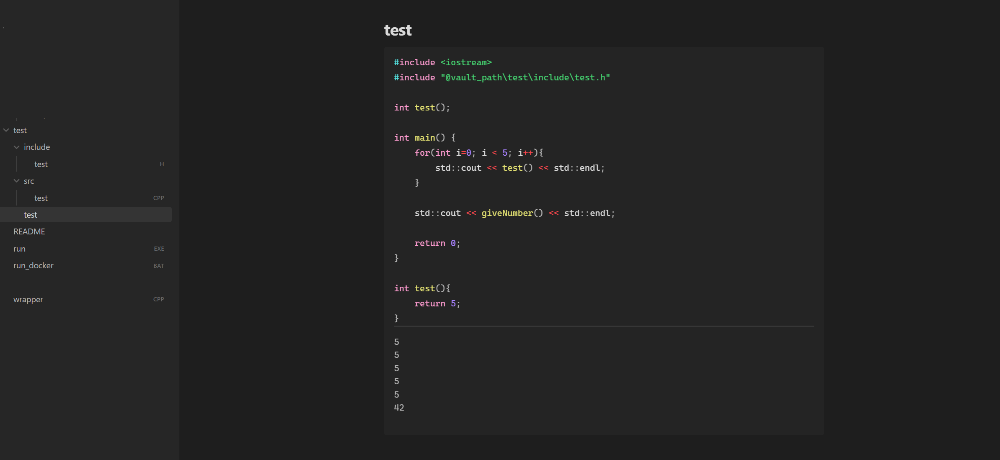
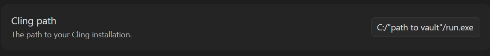

# docker-wrapper-for-obsidian-plugin-obsidian-execute-code-for-windows

A wrapper project that enables the Obsidian Execute Code extension (https://github.com/twibiral/obsidian-execute-code) to run C++ code blocks via a GCC Docker container on Windows.



## Prerequisites

Docker Engine: A functional Docker installation is required (like Docker Desktop) 

Note: 
Ensure that Docker Desktop is launched, while using the wrapper.
Activate "Show all file types" in Obsidian under "Files and Links"

## Installation & Setup

1. Clone the Repository
```bash
git clone https://github.com/your-username/obsidian-cpp-wrapper.git
cd obsidian-cpp-wrapper
```

2. Build the Wrapper
Compile the wrapper.cpp into an executable:
```bash
docker run --rm -v "${PWD}:/src" -w /src dockcross/windows-static-x64 sh -c '$CXX wrapper.cpp -o run.exe'
```

3. Configuration
 
- Move your compiled wrapper.cpp (run.exe) and run_docker.bat into your obsidian vault. Ensure run.exe and run_docker.bat stay in the same folder. 

- Open Obsidian Settings and navigate to Execute Code.

- Enter the absolute path to your run.exe file.



4. Verification (Recommended)

Run the built-in self-test to verify your setup:
```bash
run.exe -test
```
This creates a temporary test environment, compiles a sample project with includes, and validates the entire toolchain.

5. Customization (Optional)

The provided .bat script is designed to be flexible. You are welcome to modify it to better suit your development needs.

**Debug Mode:**
Both wrapper.cpp and run_docker.bat support verbose debug output:
- In wrapper.cpp: Set `DEBUG_LEVEL = 1` to see argument parsing and include resolution
- In run_docker.bat: Set `DEBUG_VAL=1` to see Docker commands and mount operations


Note: The initial execution may take longer as the Docker image needs to be downloaded (pulled) to your local machine first. Additionally, your antivirus software may flag the wrapper script or the Docker process.


## How it works

**The Workflow**
1. Obsidian calls the run.exe with a mix of flags and the code block as separate arguments.

2. The Wrapper (run.exe) analyzes each argument:
   - Extracts compiler flags (e.g., -std=c++20, -Wall)
   - Parses `#include` directives and resolves header file locations
   - Collects the actual code lines
   - Writes the processed code to a temporary file (obsidian_code.cpp)

3. The Batch Script (run_docker.bat) is invoked with organized parameters. It mounts the current directory and any detected library paths as Docker volumes with unique IDs to prevent conflicts.

4. Docker runs a GCC container, compiles the temporary file (along with any discovered source files from include/src directories), and executes the resulting binary.

5. Output is streamed back through the wrapper to your Obsidian console.

6. Cleanup: The temporary file and compiled binary are automatically removed.


**Intelligent Include Resolution**

The wrapper employs smart path detection:
- When it encounters `#include "myheader.h"`, it first checks the exact path provided
- If not found at the exact location, it recursively searches your project directory
- Once located, the parent directory is automatically added as an include path
- This allows flexible project structures without hardcoded paths


**Automatic Library Mapping**

The batch script follows this logic for paths:
- If you pass a path like C:\MyProject\include, it mounts it with a unique ID
- It then looks for C:\MyProject\src
- If found, it includes all *.cpp files from that folder in the g++ command inside the container
- This enables multi-file projects with separate header and source directories


## Troubleshooting & Diagnostics

**Self-Test Mode**

If you encounter issues, run the diagnostic self-test:
```bash
run.exe -test
```
or
```bash
run.exe -t
```
This will:
- Create a test project structure with header and source files
- Verify the Docker setup and compilation pipeline
- Report success or failure with detailed output
- Automatically clean up test files

**Debug Mode**

For detailed execution information:

1. **Wrapper Debug:** Edit wrapper.cpp and change `DEBUG_LEVEL = 1` (needs to be recompiled)
   - Shows all parsed arguments (flags, includes, code)
   - Displays include path resolution steps
   - Reports recursive file searches
   - Shows generated system call

2. **Batch Script Debug:** Edit run_docker.bat and set `DEBUG_VAL=1`
   - Displays complete Docker command being executed
   - Shows all volume mounts and include parameters
   - Lists container file system structure
   - Reports compilation and execution steps

**Common Issues**

- **Docker not found:** Ensure Docker Desktop is running
- **Permission errors:** Check that Windows Defender or antivirus isn't blocking the wrapper
- **Include not found:** Enable debug mode to see the search path
- **Compilation errors:** Use `DEBUG_VAL=1` to inspect the exact g++ command being run

# Limitations

- no Module Support
